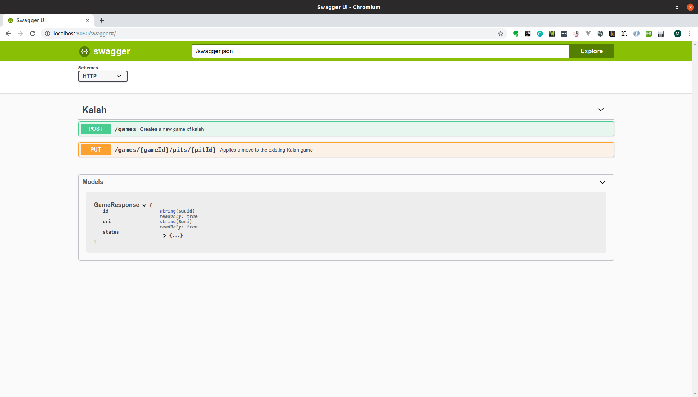

# Kalah

A coding challenge to implement a RESTful game of Kalah. Check out the rules at https://en.wikipedia.org/wiki/Kalah.

## Build

To build the application just run:

`mvn clean install`

## Build Docker Image

To build the application bundled in a docker image run:

`mvn clean install -Pdocker`

Or if you want to run without building locally, just pull the image:

`docker pull lucas1000001/kalah:latest`

## Run

To run the application execute the following command:

`java -jar target/kalah-1.0.0-SNAPSHOT.jar server config.yml`

Or alternatively to run the docker image:

`docker run -p 8080:8080 lucas1000001/kalah:latest`

## API / Swagger

To use the application, you can check out the API using the swagger UI:

`http://localhost:8080/swagger`

A snapshot of this is shown below:

## TODOs

There are a ton of enhancements that could be made to the app, including:

* Use of Redis / Elasticache as a persistent backend store, rather than a lossy in-memory repo
* Additional rules to cater for other edge cases knowingly missed
* Use of property based testing / fuzzing or even Markov chains to test app more thoroughly
* Structured logging with MDC, rather than unstructured logging
* Refactoring of Board - Visitor relationship. Even though generally seems ok, the amount of coupling is unfortable
  and probably suggests design flaws
* Improvements to API to make it more extensive and more robust
* Consider any race conditions in updates (currently last in line wins)
* ... many more
